# Passive Suitmation Dinosaur Tail: physics prototype + printable POC

A completely passive (no motors, electronics or pneumatics) 1.4 m ball-and-socket tail for a **5 ft 8 in (1.727 m)**
performer. It was validated in a MuJoCo physics prototype first, then turned into parametric OpenSCAD and FreeCAD
models and print-ready STLs:
- sized for an Ender 3 V2 / Sprite Pro with a **1.2 mm nozzle**;
- **no printed part larger than a 20 cm cube**.

- Original design brief: [docs/brief.md](docs/brief.md)
- Full documentation index: [docs/README.md](docs/README.md)

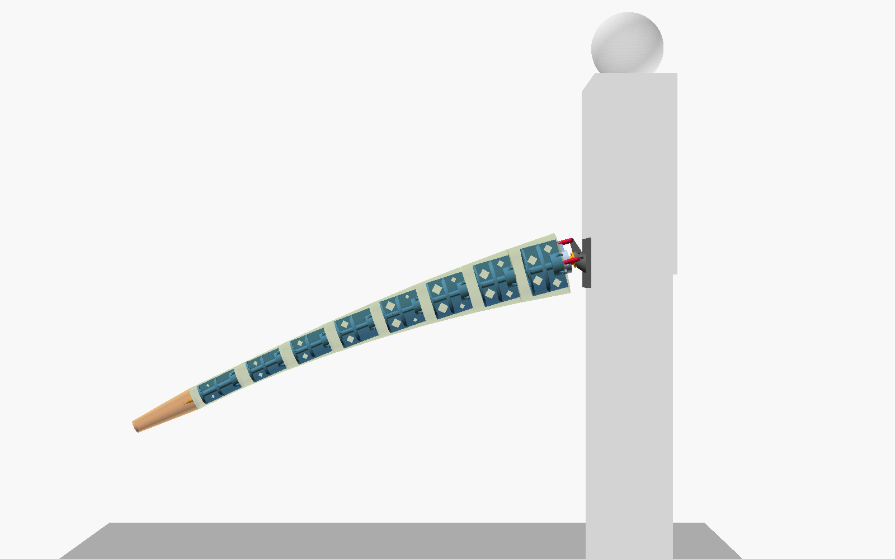

---

## 0. Gojira profile ("x² + 1"): the optimal, cheapest workable tail, ready to print

The target shape: the tail drops from the hips, sweeps a few centimetres **above** the floor without touching it,
and the tip curls up. Five mechanisms were simulated on this exact shape; full comparison and build notes are in
[docs/gojira.md](docs/gojira.md).

**Answer: the ball-and-socket chain with the spring spine, reshaped to 1.8 m.**
- 10 joints × 150 mm plus a 0.3 m foam tip.
- The rest curve is printed into wedge flanges.
- Felt seat liners and a light 5 N cord.

**As built** (masses measured from the exported STLs + hardware + foam, 3.3 kg):
- **Hover:** 8.6 cm above the floor at rest; clear while walking and crouching
  (1.4 cm).
- **Swing:** lags 38° behind a 30° hip snap, overshoots 26°,
  swings back 2 times and settles in 4.5 s.
- **Walking:** tip moves 1.1× the hip.
- **Jump landing:** a gentle 26 N floor touch.

The cheaper candidates each fail a requirement:
- **Gate hinges** (yaw-only, gravity-centred, no springs): the cheapest and simplest, but rigid in pitch. A jump
  landing slams the hovering tail into the floor with **~860 N and ~670 N·m into the performer's pelvis**.
- **Pre-bent elastic tube spine:** drags and loses the swing-back.
- **Ball chain resting on its stops:** freezes and sags onto the floor.

**What to print:**
- [`cad/stl/gojira/`](cad/stl/gojira/): 43 print-ready STLs, 2.6 kg of PETG. Print list:
  [docs/tables/gojira_parts.md](docs/tables/gojira_parts.md).
- [`cad/stl/gojira_test_section/`](cad/stl/gojira_test_section/): the 4-joint prototype kit.

- [`cad/stl/replica_1to8_resin/`](cad/stl/replica_1to8_resin/): a **1:8 scale resin display replica**
  (mechanism or skinned, one piece each, plus a stand) for the Photon Mono 5s.

Also available:
- FreeCAD/STEP: [`cad/freecad/output/suit_tail_gojira.step`](cad/freecad/output/suit_tail_gojira.step).
- Spring schedule: [docs/tables/gojira_springs.md](docs/tables/gojira_springs.md).
- Strength (all SF ≥ 3): [docs/tables/gojira_strength.md](docs/tables/gojira_strength.md).

### Shopping list (Gojira tail, 10 joints)

Quantities are for the full tail. The 4-joint prototype needs roughly the joint 1–4 share plus the ballast items.
Prices are rough commodity estimates in USD. Buy about 10 % spare hardware, since small screws disappear backstage.

**Printing**

| Item | Qty | Notes | ~Cost |
|---|---|---|---|
| PETG filament, 1.75 mm | 3 × 1 kg | 2.6 kg of parts ([print list](docs/tables/gojira_parts.md)) + supports/purges | $60 |
| 1.2 mm hardened or brass nozzle for the Sprite Pro | 1 | Settings in [docs/printing.md](docs/printing.md) | $10 |
| TPU 95A filament (optional) | 250 g | Stop pads instead of felt | $10 |

**Fasteners** (steel, socket-head)

| Item | Qty | Use | ~Cost |
|---|---|---|---|
| M4 × 16 socket-head cap screw | 80 | 4 per cap + 4 per ball flange, 10 joints | $10 |
| M4 nylock nut | 80 | Press into the printed hex pockets | $6 |
| M4 × 12 socket-head cap screw | 4 | Roll-key pins, joints 1–4 (head captured in the ball) | $1 |
| M3 × 8 socket-head cap screw | 10 | Roll-key pins joints 5–10 (6) + tip adapter to vertebra 10 (4) | $2 |
| M6 bolt + washer + nylock (length to suit your harness plate) | 4 | Hip mount to the harness, 150 × 100 mm pattern | $4 |

**Springs** (full schedule per joint: [docs/tables/gojira_springs.md](docs/tables/gojira_springs.md))

50 extension springs in total (30 positions, 20 of them doubled up). The installed length is short, 32–40 mm between
hook holes. Buy assortments in these three bands and set each spring's rest tension with a short loop of the
cord/wire on one hook; the prototype tests then calibrate it.

| Band | Qty | Positions | Target per spring |
|---|---|---|---|
| Heavy | 8 | Dorsal pairs, joints 1–4 | OD ≤ 15 mm (J1) … 11 mm (J4), ~11–18 N/mm, 90–120 N at rest, must survive 230 N |
| Medium | 14 | Dorsal pairs J5–J8 (8), single laterals J1–J3 (6) | OD 7–10 mm, ~6–9 N/mm, 35–75 N at rest, up to ~135 N |
| Light | 28 | Lateral pairs J4–J9 (24), J9 dorsal (1), J10 laterals + dorsal (3) | OD 5.5–10 mm, ~4–11 N/mm, 15–40 N at rest, up to ~115 N |
| + compression spring | 1 | Cord preload at the tip adapter | Ø ≤ 13 mm, ~2 N/mm, ~20 mm free length |

Spring assortments run about $40–80 in total.

**Cord, liners, pads**

| Item | Qty | Use | ~Cost |
|---|---|---|---|
| 6 mm braided polyester cord (or paracord) | 2.5 m | Central cord, hip-mount knot to tip spring | $5 |
| Cord lock + 2 washers (M6/M8) | 1 set | Tip end of the cord, over the compression spring | $3 |
| Self-adhesive felt, 0.5 mm (or PTFE tape 0.25 mm) | ~0.1 m² | Socket seat liners (felt = the tuned friction) | $6 |
| Self-adhesive felt or rubber, 0.8 mm | small sheet | Cap-mouth stop pads | $4 |
| 1.75 mm filament offcuts | 20 × 10 mm | Ball-half alignment dowels | – |
| CA glue or 2-part epoxy | 1 | Ball halves (optional) and foam | $8 |

**Skin and foam tip**

| Item | Qty | Use | ~Cost |
|---|---|---|---|
| Upholstery foam sheet, ~20 mm (plus a 10 mm sheet for the thin end) | ~1 m × 2 m | Skin over the frame rings and fins (20 mm at the root tapering to 4 mm) | $30–50 |
| Upholstery or EVA foam block | 300 × 80 × 80 mm | 0.3 m flexible foam tip on the tip-adapter spike | $10 |
| 4-way stretch spandex | ~1.5 m × 1.5 m | Outer skin | $15 |
| Contact cement / spray adhesive | 1 can | Foam to frame, spandex to foam | $12 |
| Latex or silicone paint, dorsal plates (EVA or foam) | to taste | Kaiju finish | varies |

**Harness** (not printed)

A rigid hip plate or backpack frame with a padded waist belt that accepts the 4 × M6 pattern (or two 50 mm webbing
straps through the plate slots). It must carry ~35 N and up to ~25 N·m at the pelvis. Don't bolt it to costume
foam. A used hiking-pack frame or a plywood/aluminium hip plate works; ~$20–60.

**4-joint prototype only**

| Item | Qty | Use | ~Cost |
|---|---|---|---|
| M8 threaded rod | 400 mm | Ballast rod through the ballast plate | $4 |
| M8 nuts + large washers | 4 nuts, washers to **~625 g**, centred ~290 mm past joint 5 | Stands in for vertebrae 5–10 ([docs/test_plan.md](docs/test_plan.md)) | $10 |
| Luggage/hanging scale | 1 | Breakaway-torque and stiffness tests | $10 |

**Tools**
- Drill bits 3.4 mm and 4.5 mm, to size the printed holes.
- 2.5 / 3 / 5 mm hex keys and a 7 mm nut driver.
- Pliers, for the spring hooks.
- Scissors or knife, for the foam.

**Rough total:** ~$250–350 for the full tail, excluding the harness and paint.

### CAD assembly: the real printed parts

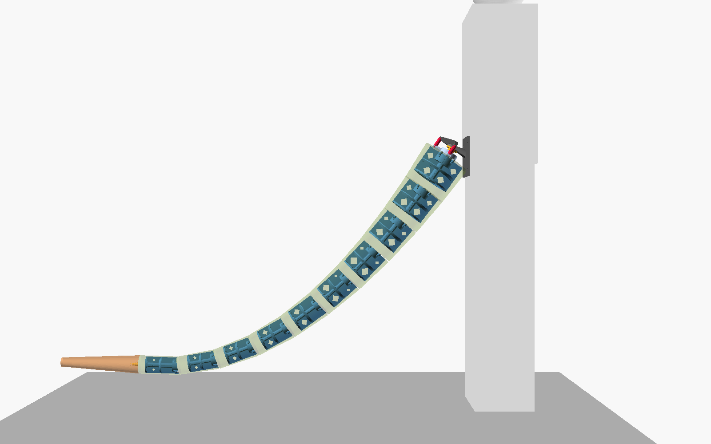

| Top | Maximum curvature with limit cones | 4-joint prototype |
|---|---|---|
| 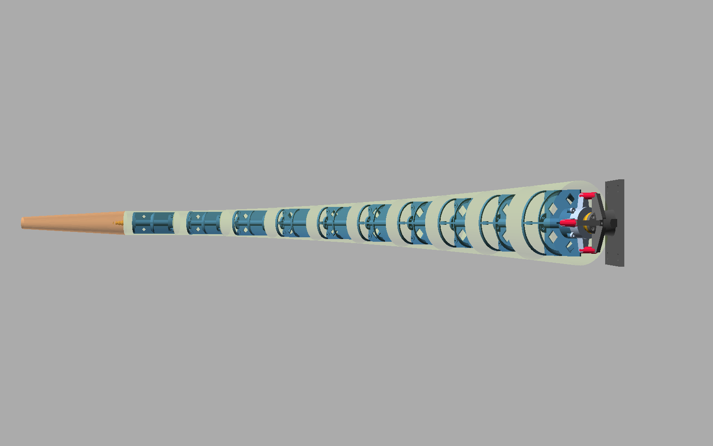 | 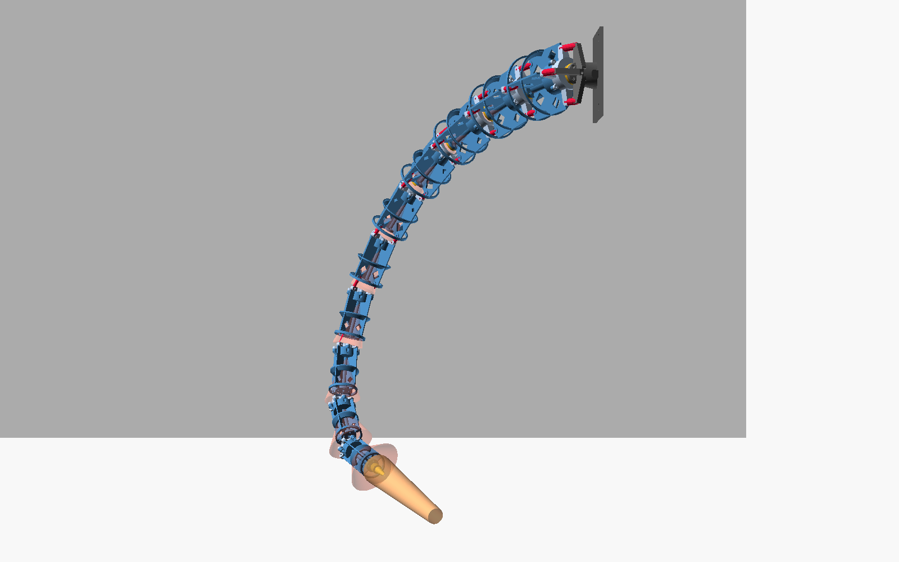 | 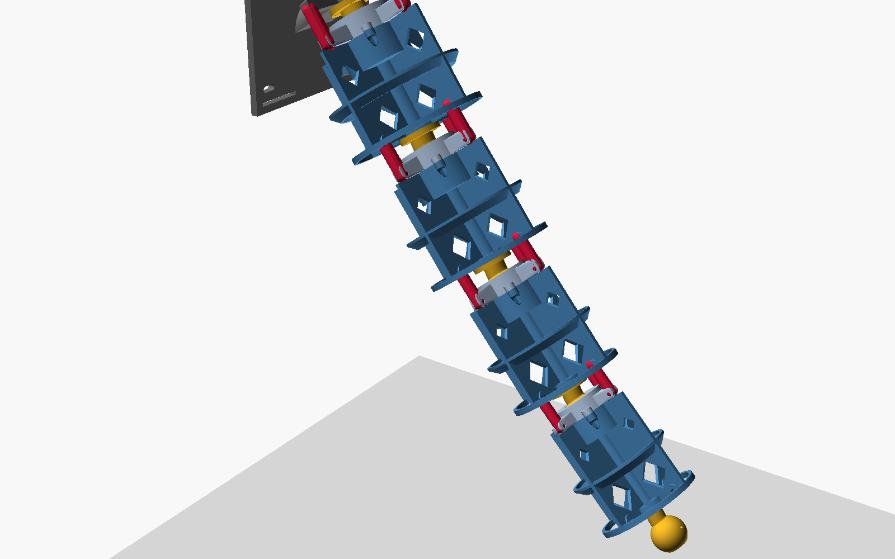 |

| Exploded vertebra | Joint section | Hip mount (55° root) |
|---|---|---|
| 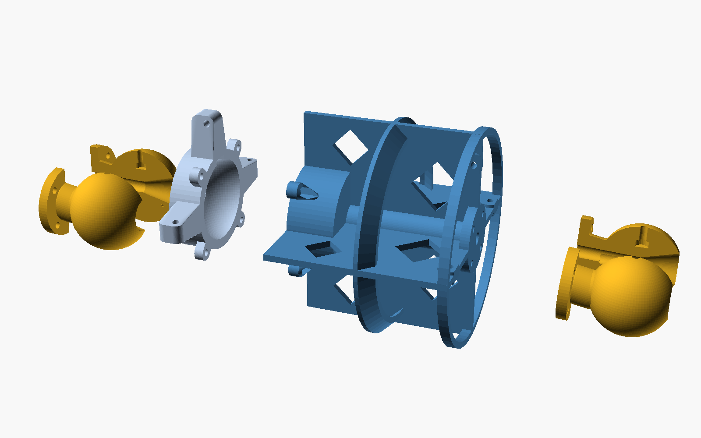 |  | 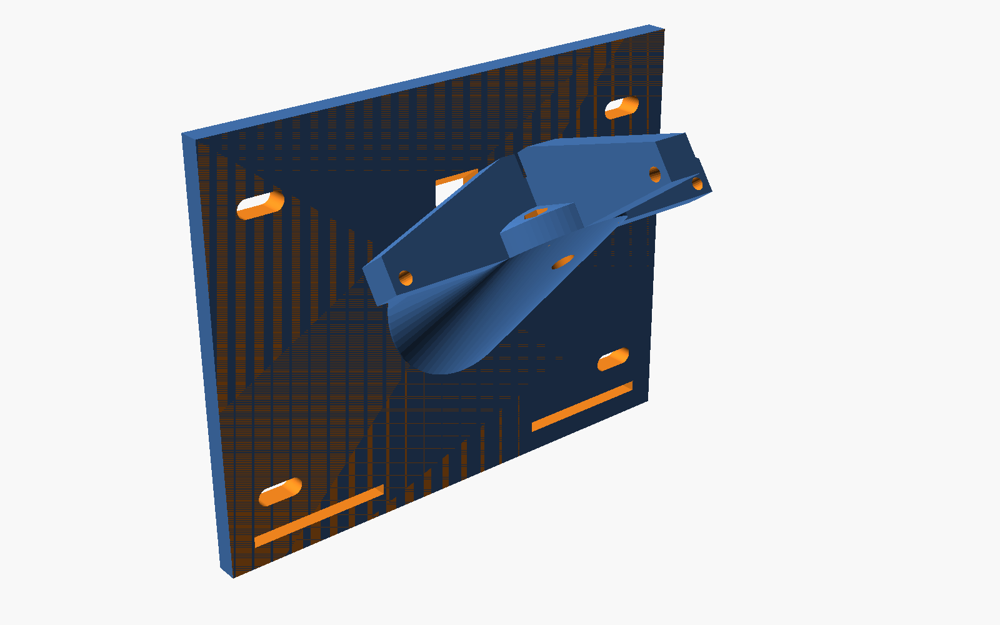 |

### The full tail on a performer in five simulated poses

Every row is the same instant of the as-built simulation, shown three ways:
1. **Photo:** a Z-Image Turbo image-to-image pass over the physics render (denoise 0.55), which keeps the simulated
   geometry.
2. **Physics render:** the smooth skin from the simulated body positions.
3. **CAD render:** the actual exported STLs articulated with the simulated joint angles.

| Pose | Simulated photo | Physics render | CAD render |
|---|---|---|---|
| Standing still |  |  | 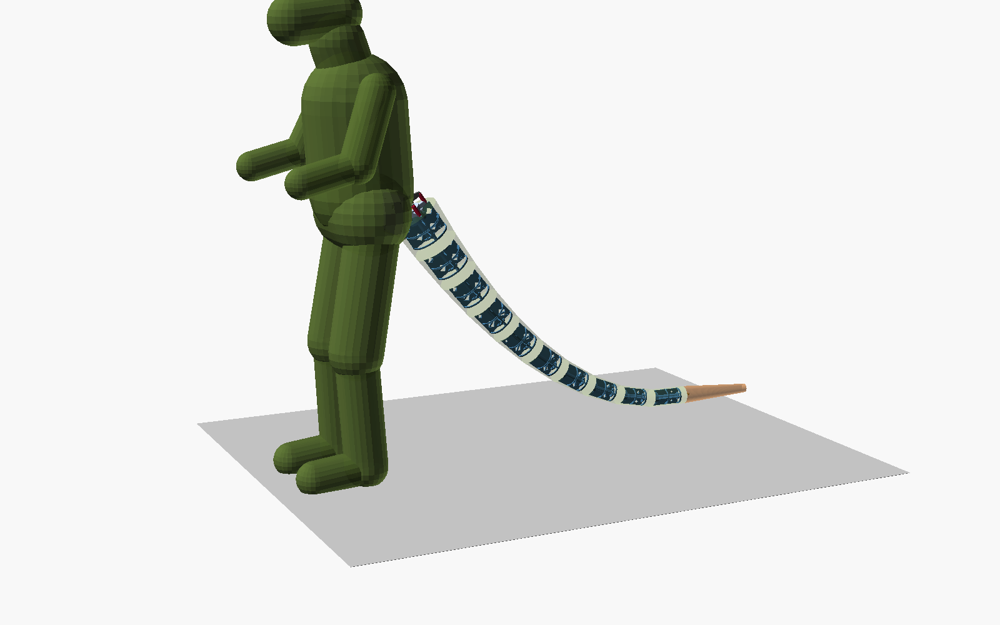 |
| Bending over |  |  | 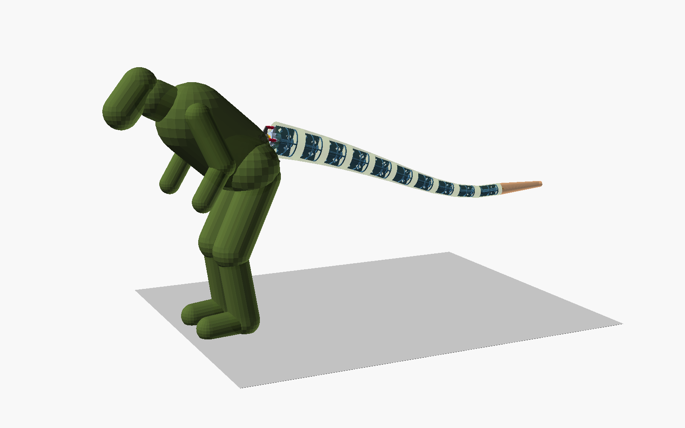 |
| Turning (45°) |  |  | 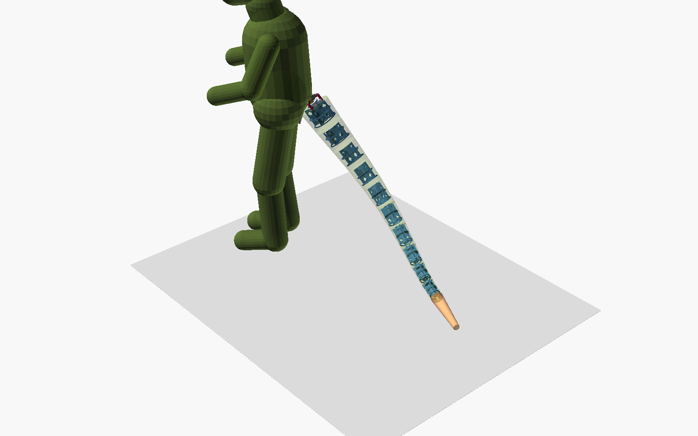 |
| Jerk to the left |  |  | 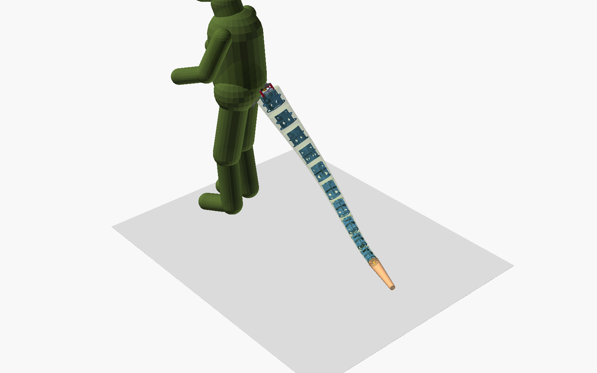 |
| Jump, just before landing |  |  | 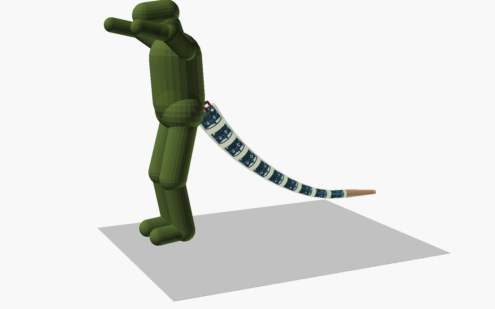 |

Plots for the Gojira finalists:
- [hip snap](results/figures/gojira_hip_snap_30.png)
- [jump](results/figures/gojira_jump.png)
- [bend over](results/figures/gojira_bend_over.png)
- [turn](results/figures/gojira_dramatic_turn_45.png)
- [walking](results/figures/gojira_walk_1.50Hz.png)
- [crouch](results/figures/gojira_crouch.png)

As-built responses:
- [hip snap](results/figures/gojira_as_built_hip_snap_30.png)
- [jump](results/figures/gojira_as_built_jump.png)
- [bend over](results/figures/gojira_as_built_bend_over.png)

> Sections 1–5 below document the original, straighter 1.4 m, 8-joint tail from the brief (STLs in
> `cad/stl/full/`). The mechanism, physics findings and printing notes all carry over to the Gojira variant above.

---

## 1. The answer to the brief's question

> *When a performer turns their hips, does this mechanism produce the exaggerated but physically believable
> secondary tail movement of practical creature suits?*

**Yes, but only with passive centring springs across every joint.** A ball chain with friction, a central cord and
angular stops alone never swings back. With the spring spine designed here, and the **as-built masses measured from
the exported CAD**, the tail's response to a 30° hip snap in 0.35 s is:

| Metric | As built | Brief's target |
|---|---|---|
| Maximum tip lag behind the hip | **38.6°** | tail mass lags behind |
| Tip overshoot after the hip stops | **10.3° (34 %)** | tip overshoots |
| Visible swing-backs | **1** | 1–2 decreasing oscillations |
| Settling time (within 2°) | **1.9 s** | settles |
| Residual offset | **0.0°** | — |
| 45° dramatic-turn overshoot | **28.7°** | tip swings noticeably |
| Walking tip/hip yaw ratio (1.5 / 2.0 steps/s) | **1.61 / 1.27**, no stop hits | visible but restrained, not whip-like |
| Crouch (−150 mm, 10° pitch) | no floor contact, no binding | no binding |

| 30° hip snap (as built) | 45° dramatic turn (as built) | Walking, 1.5 steps/s |
|---|---|---|
| 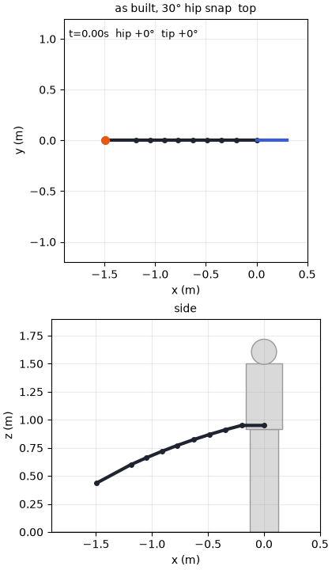 | 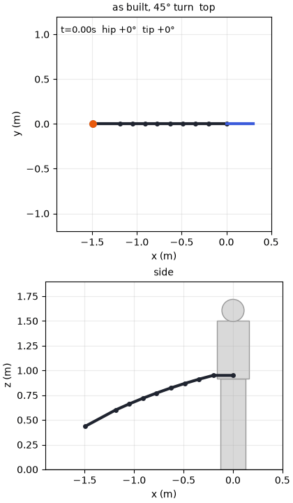 | 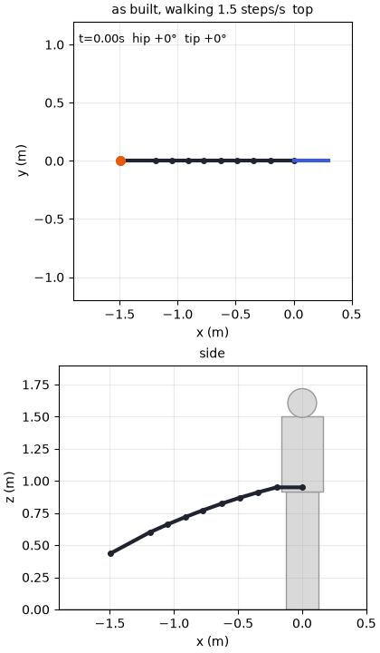 |

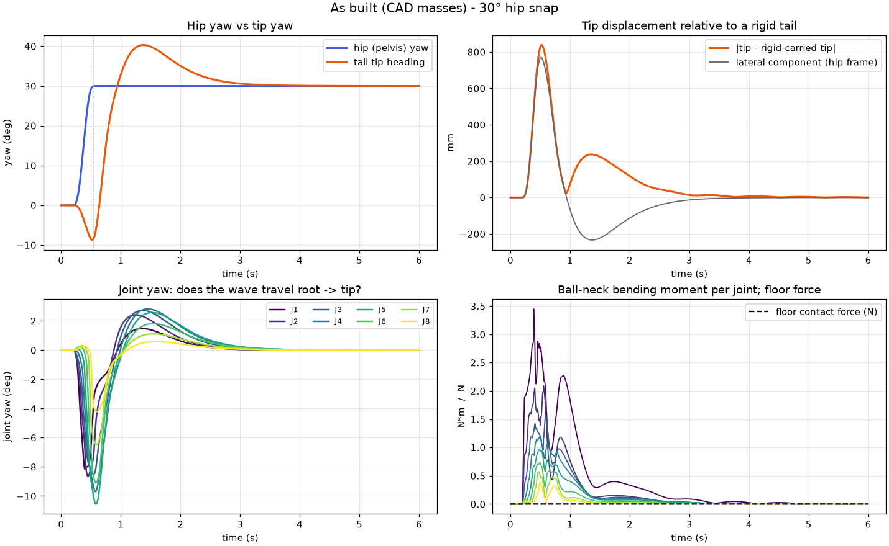

**The curve propagates root → tip.** The peak yaw of each joint arrives in sequence, J1 at ~0.39 s and J8 at
~0.60 s, and the return swing follows the same order:

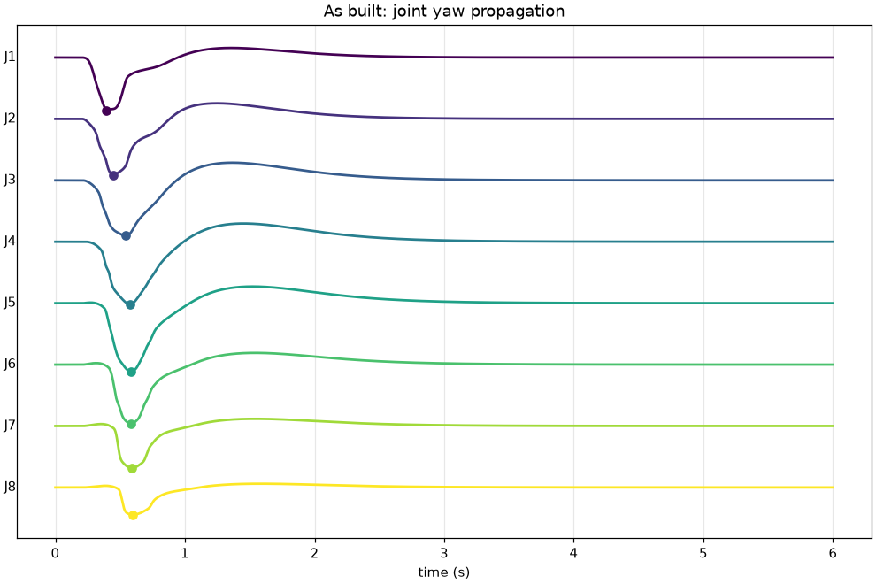

---

## 2. What the physics prototype found (and how it changed the design)

Details: [docs/physics.md](docs/physics.md).

1. **Friction alone cannot swing back; springs are required.** The overshoot → return swing → settle sequence is a
   spring–mass behaviour. A cord through the ball centres stores no bending energy, because its length doesn't
   change when a joint bends. Each joint therefore gets three tension-only extension springs:
   - **dorsal:** carries the tail's weight moment (~145 N at the root);
   - **left and right:** a pair that gives yaw centring.

   Without springs the tail never follows the hip: it ends 33° off and drags on the floor when crouching.
   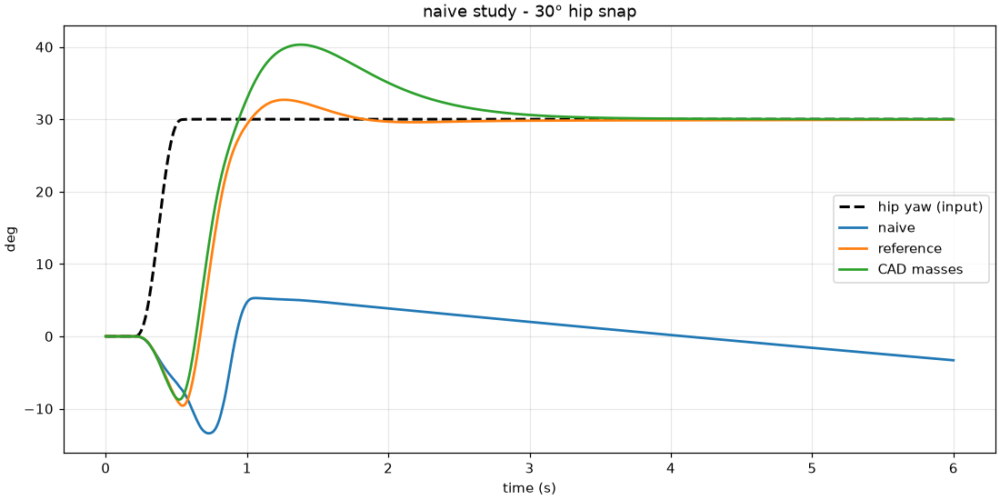
   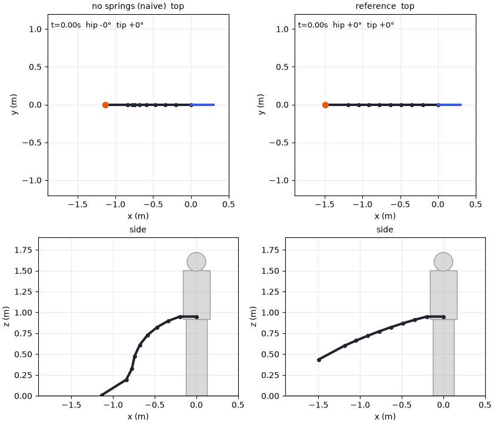

2. **Where the springs attach decides twist stability.** With the child spring anchor distal of the pivot, the
   preloaded dorsal spring made a statically **unstable** yaw–roll twist mode. The linear analysis found a lowest
   mode of −0.28 Hz, and in the time domain the tail slowly corkscrewed away from centre. Moving the child anchor
   onto an **ear on the socket cap, 5 mm proximal of the pivot** makes the same springs centring: the lowest mode
   becomes +0.32 Hz with no extra parts.

3. **Springs must beat the friction dead band.** Spring rates are sized from the larger of an inertia rule and
   τ_friction / 3.5°. Otherwise the tip sticks tens of degrees off-centre.

4. **The roll key matters.** Removing it halves the swing (turn overshoot 28.7° → 11.2°); the energy leaks into
   twisting.
   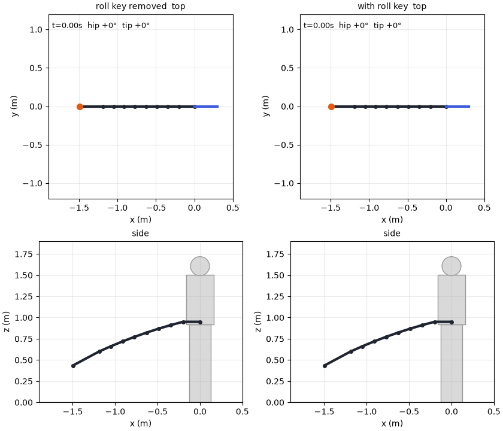

5. **The seat liner is the main tuning knob.** Cord preload barely matters on built hardware (5 → 40 N changes the
   overshoot by 0.4°), because the springs dominate the seat load. Treat the cord as retention only.

   | Friction liner (same built tail) | Cord preload (same built tail) | COM offset & roll key (same built tail) |
   |---|---|---|
   | 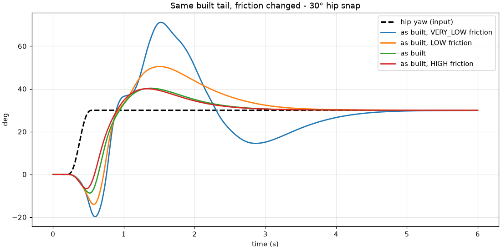 | 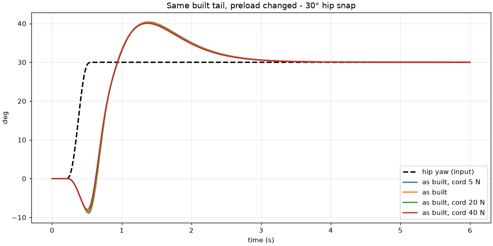 | 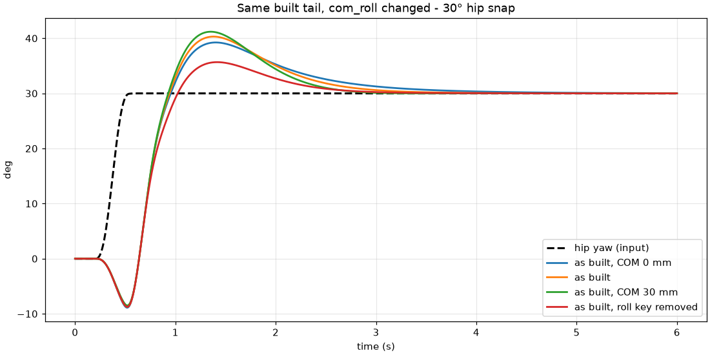 |

   PTFE (VERY_LOW) gives a whippy 41° overshoot with 2 oscillations; felt (MEDIUM, the reference) gives 10° with
   one; HIGH friction is dull.

6. **The COM offset (gravity bias) helps roll, not yaw.** 15 mm below the pivot stiffens the twist mode and settles
   slightly cleaner. 50 mm adds little.
   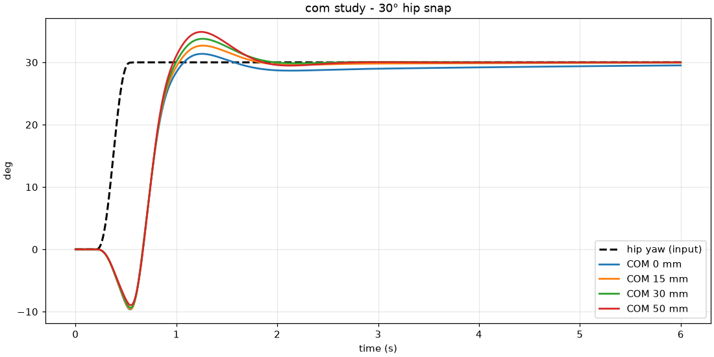

7. **Walking stays restrained.** Pelvis yaw repeats at the stride rate (half the step rate), which is above the
   tail's first swing mode. The tip moves 1.3–1.8× the hip, with no stop hits.
   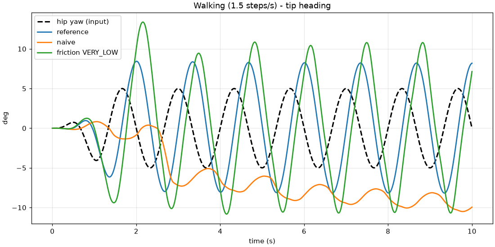

8. **The distal end is heavier than the brief's guess.** The as-built total is ~2.55 kg against 2.0 kg: the root
   segment is +12 % and the tip segments are 1.5–2.8× over, set by the minimum practical ball and the M4 hardware.
   All tests were re-run with these masses; the heavier tip makes the motion *more* theatrical.
   See [docs/tables/mass_budget.md](docs/tables/mass_budget.md).

### brief §27 comparison: configurations A–D on identical inputs

All four include the spring spine. A = friction only (no cord), B = + cord preload, C = + 15 mm COM offset,
D = + progressive joint limits 8° → 28°. Full numbers in [docs/tables/study.md](docs/tables/study.md). No single
winner is declared: D is the most controlled, while A–C swing more.

| Hip snap | Dramatic turn | Walking 1.5 steps/s |
|---|---|---|
| 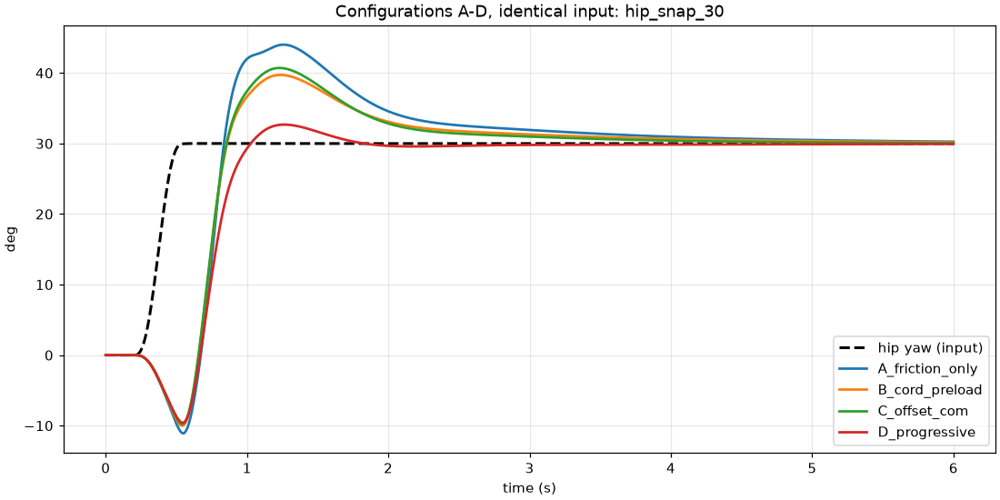 | 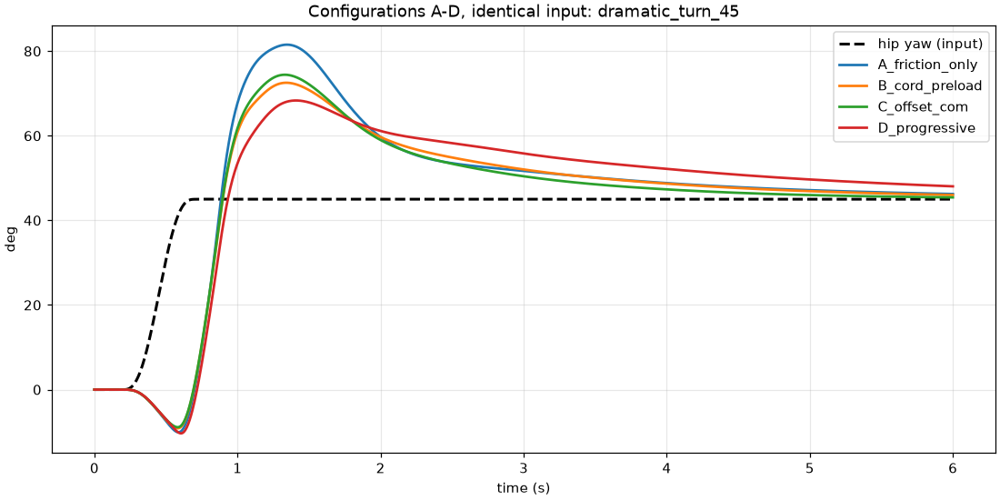 | 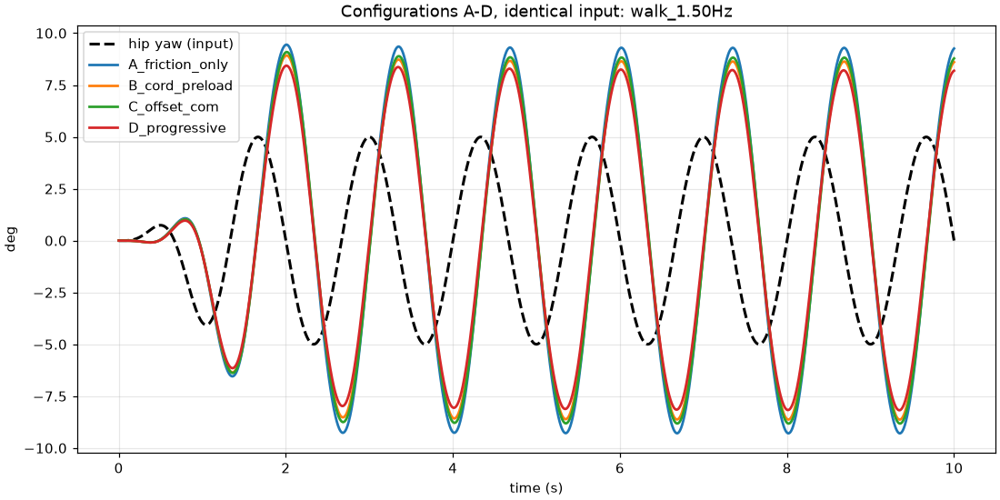 |

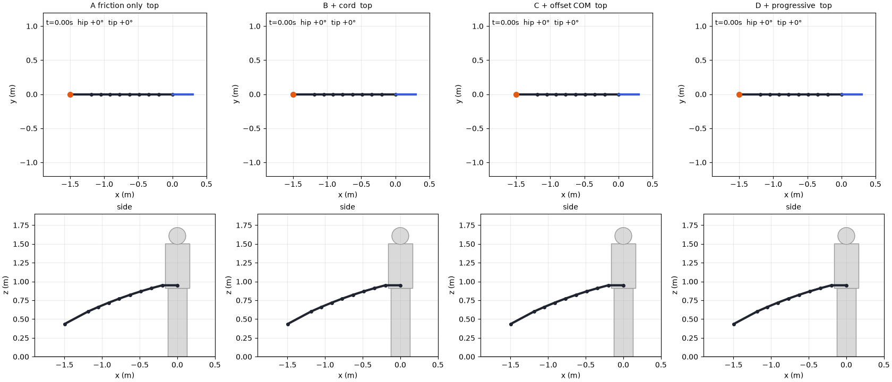

Side-by-side videos:
- [hip snap (mp4)](results/animations/compare_ABCD_hip_snap_30.mp4)
- [dramatic turn (mp4)](results/animations/compare_ABCD_dramatic_turn_45.mp4)
- [walking (mp4)](results/animations/compare_ABCD_walk_1.50Hz.mp4)

Other tests for A–D:
- [side step](results/figures/compare_ABCD_side_step_300mm.png)
- [crouch](results/figures/compare_ABCD_crouch.png)
- [walking at 2.0 steps/s](results/figures/compare_ABCD_walk_2.00Hz.png)
- [brief-literal walk](results/figures/compare_ABCD_walk_1.75Hz_literal.png)

Parameter studies (each re-designs its springs):
- [friction](results/figures/study_friction_hip_snap.png)
- [cord preload](results/figures/study_preload_hip_snap.png)
- [roll](results/figures/study_roll_hip_snap.png)

Reference-design responses (brief masses):
- [hip snap](results/figures/reference_hip_snap_30.png)
- [joint waterfall](results/figures/reference_hip_snap_joint_waterfall.png)
- [turn](results/figures/reference_dramatic_turn_45.png)
- [side step](results/figures/reference_side_step_300mm.png)
- [crouch](results/figures/reference_crouch.png) and [crouch animation](results/animations/reference_crouch.gif)
- walks at [1.5](results/figures/reference_walk_1.50Hz.png), [2.0](results/figures/reference_walk_2.00Hz.png)
  and [brief-literal](results/figures/reference_walk_1.75Hz_literal.png) steps/s

### How the model was validated

[tests/test_physics.py](tests/test_physics.py): 8 tests, all passing.
- **Statics:** static support, and the ball load checked against a hand vector sum.
- **Energy:** conserved to within the stop-constraint work.
- **Modes:** the linearised modes match the time-domain frequencies within 5 %.
- **Numerics and model behaviour:** dt convergence, hip tracking, tension-only cord and springs, and the gravity-bias
  torque.

Per-timestep CSVs:
- [results/data/reference_hip_snap_30.csv](results/data/reference_hip_snap_30.csv)
- `results/data/csv/*.csv.gz`: every test for A–D, the reference, the naive build and as-built

---

## 3. Mechanical design and CAD

Details: [docs/design.md](docs/design.md).

- **Joints:** 8 ball-and-socket joints at 150 mm pitch.
  - Taper 190 → 70 mm envelope (p = 1.3), plus a 200 mm foam tip.
  - Two-piece bolted socket: the seat is in the frame, and a cap bolts on with 4 × M4.
  - Elliptical cap-mouth stops: yaw 8° → 28°, pitch 0.7 × yaw.
  - Captured-screw **roll key** limits roll to ±7°.
- **Springs:** 3 extension springs per joint, from the parent fin end to the cap ear. Schedule in
  [docs/tables/springs.md](docs/tables/springs.md).
- **Central cord:** 6 mm braided cord, knotted in the hip mount and preloaded 5–10 N by a compression spring in the
  tip adapter.
- **Hip mount:** a harness plate (M6 on a 150 × 100 mm pattern, plus webbing slots) with joint 1 200 mm behind the
  pelvis centre, pointing 15° nose-down.

| Neutral (top) | Moderate turn | Maximum curvature with limit cones |
|---|---|---|
| 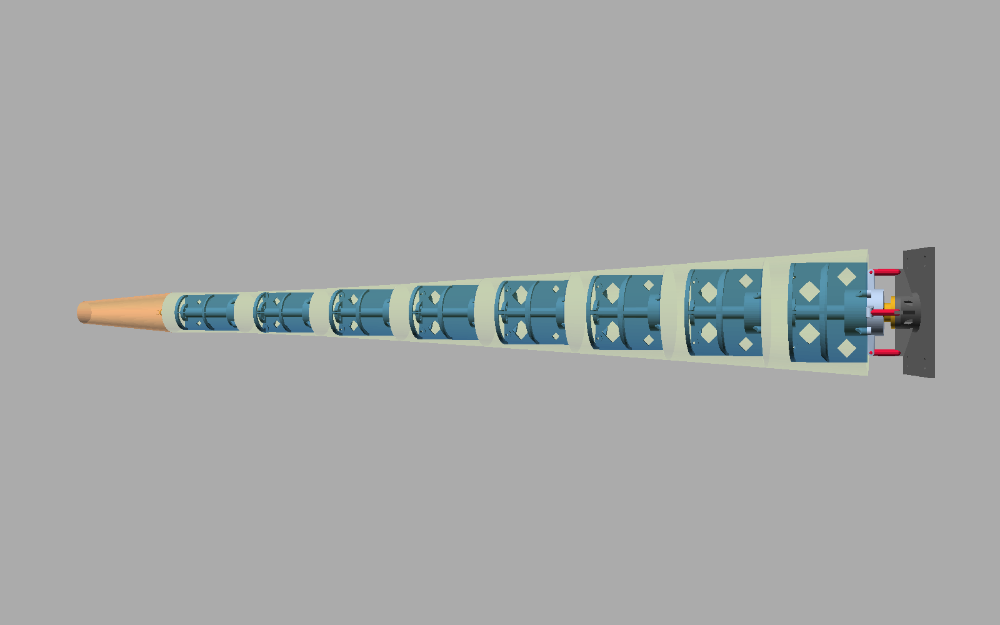 | 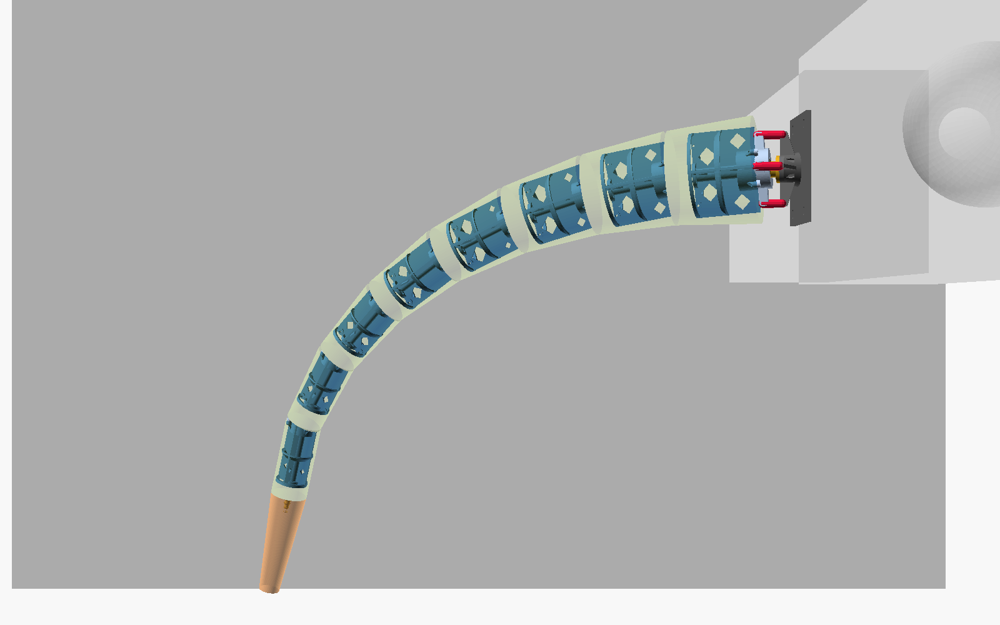 | 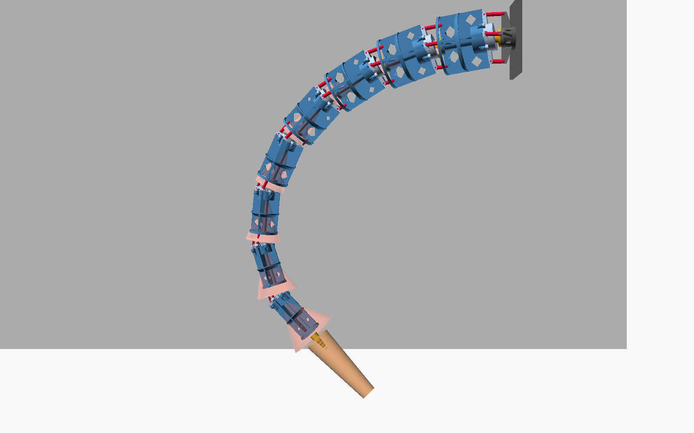 |

| Exploded vertebra | Joint cross-section | Central cord path |
|---|---|---|
| 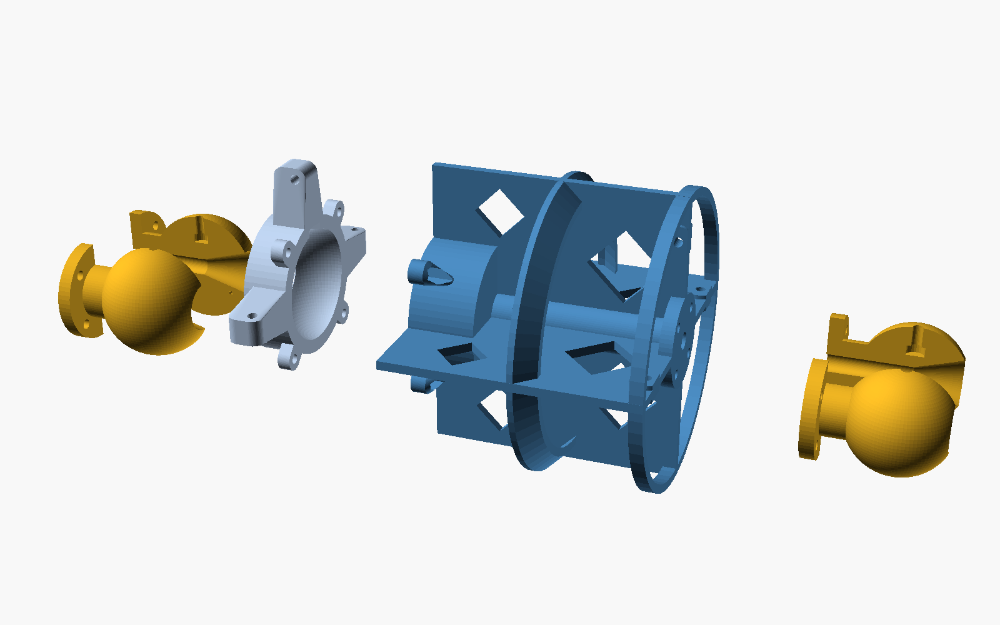 | 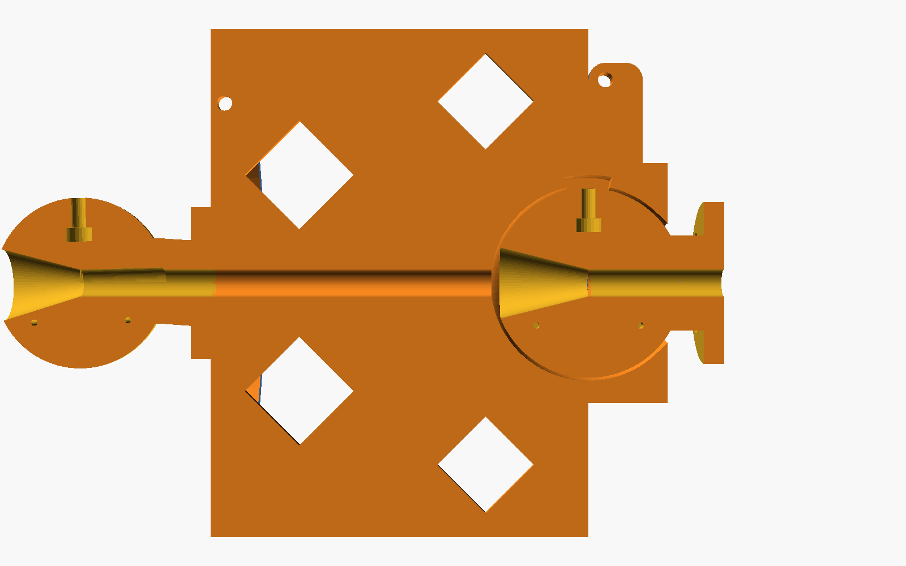 | 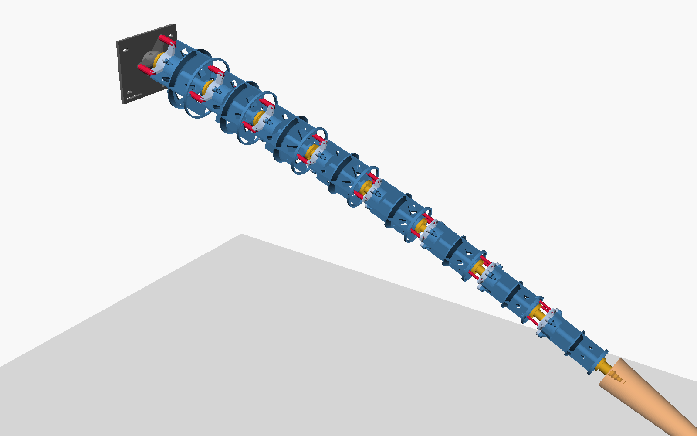 |

| Ball (clamshell) | Socket + cap with spring ears | Vertebra 1 | Hip mount |
|---|---|---|---|
| 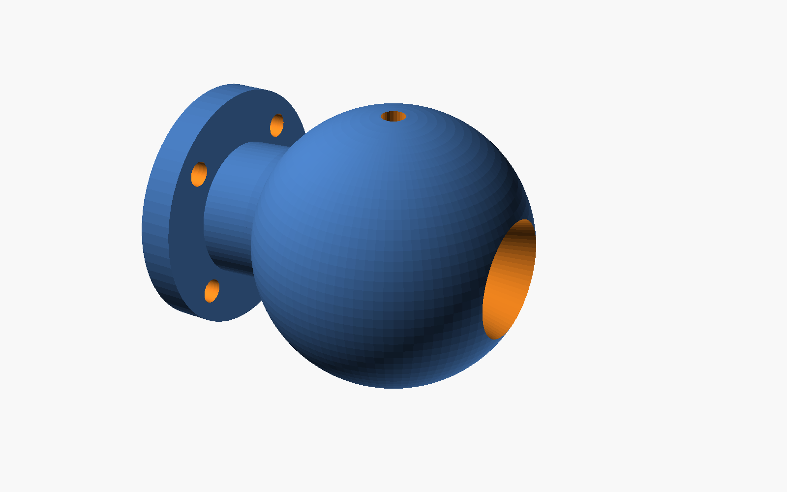 | 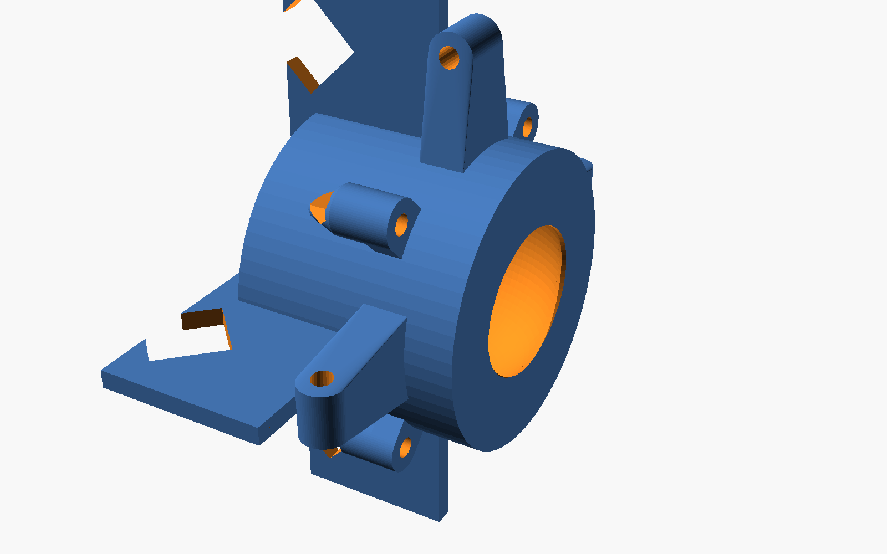 | 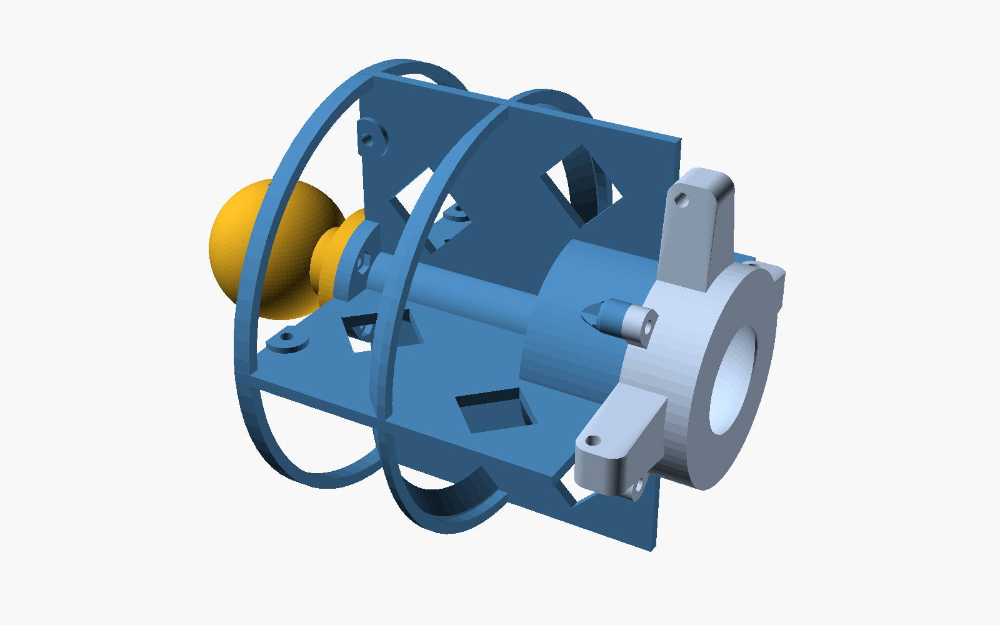 | 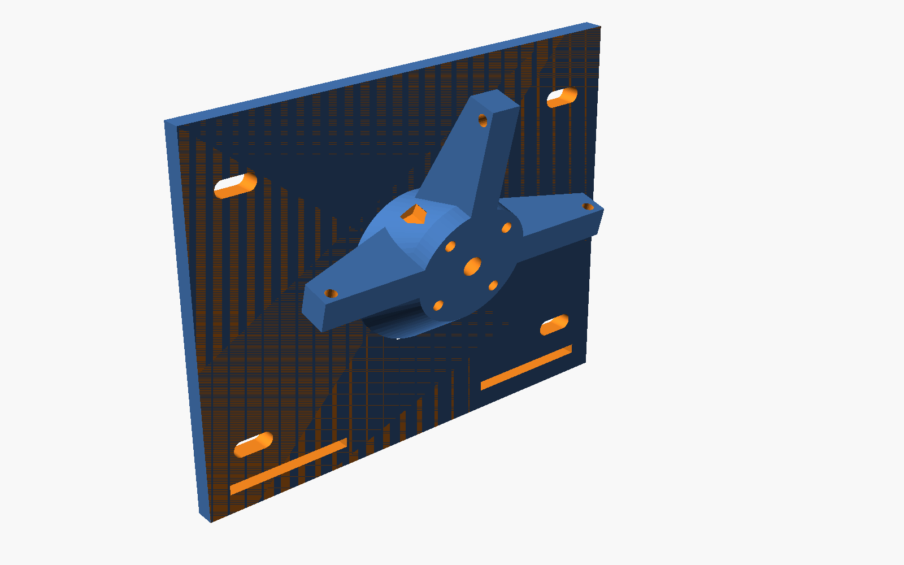 |

More views:
- [isometric maximum curvature with the performer](results/cad_renders/iso_max_curvature.png)
- [section through joint 5](results/cad_renders/section_joint_5.png)

**Strength** (as-built simulated peak loads, [docs/tables/strength.md](docs/tables/strength.md)):
- ball necks: SF ≥ 4.9;
- root cap ear: SF 3.0;
- drop and floor-strike tests are in the prototype plan.

### CAD files

| Deliverable | Path |
|---|---|
| Parametric OpenSCAD (brief §20 modules, `PART` views, print-oriented parts) | [cad/openscad/suit_tail.scad](cad/openscad/suit_tail.scad) |
| Parametric FreeCAD builder (`createVertebra(index, parameters)`) | [cad/freecad/build_tail.py](cad/freecad/build_tail.py) |
| FreeCAD documents + STEP (full tail, 4-joint test section) | [cad/freecad/output/](cad/freecad/output/) |
| Print-ready STLs, full tail (35 parts) | [cad/stl/full/](cad/stl/full/) |
| Print-ready STLs, 4-joint test section kit | [cad/stl/test_section/](cad/stl/test_section/) |
| Part sizes, volumes, estimated masses | [cad/stl/parts.json](cad/stl/parts.json) |
| Shared dimensional spec + clearance checks | [cad/geometry.py](cad/geometry.py) |

---

## 4. Printing and material

Details: [docs/printing.md](docs/printing.md).

- **PETG for every structural part** at 1.3 mm lines and 0.6 mm layers (0.4 mm for ball halves).
  - Walls are whole multiples of the line width.
  - No supports; ball halves print flat, with layers along the neck.
  - Ball halves for joints 1–3 at 100 % infill.
- **TPU** is optional, for stop pads.
- **Resin (Photon Mono 5s, ABS-Like Pro 2) is not recommended for structural parts:**
  - the two largest vertebrae don't fit its ~123 mm axis;
  - solid resin adds mass at the already heavy tip;
  - brittle failures would happen at the necks and cap lips.

  The physics would allow hollow resin balls for joints 4–8 only (for a smoother bearing), but sanded PETG with a
  PTFE-tape liner does nearly as well.

## 5. Next step: the 4-joint physical prototype

Hip mount + vertebrae 1–4 + a 625 g washer ballast rod standing in for the rest of the tail (same distal mass and
moment). The simulation predicts 32° lag, 12° overshoot, one swing-back and 1.2 s settling, close to the full tail,
so tuning done on it carries over. The measurement plan, which calibrates friction, spring stiffness and damping in
the model, is in [docs/test_plan.md](docs/test_plan.md).

| 4-joint section (CAD) | Simulated response |
|---|---|
| 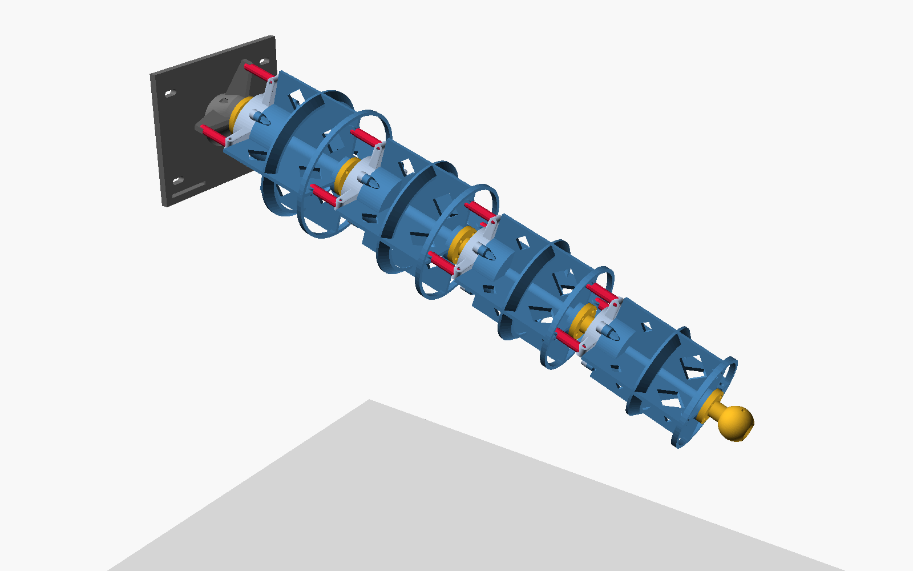 | 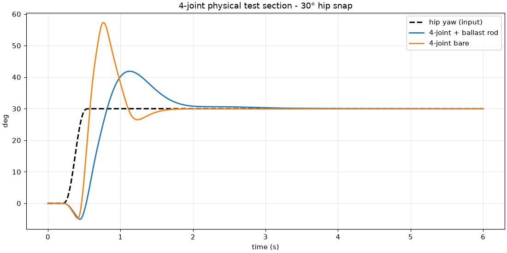 |

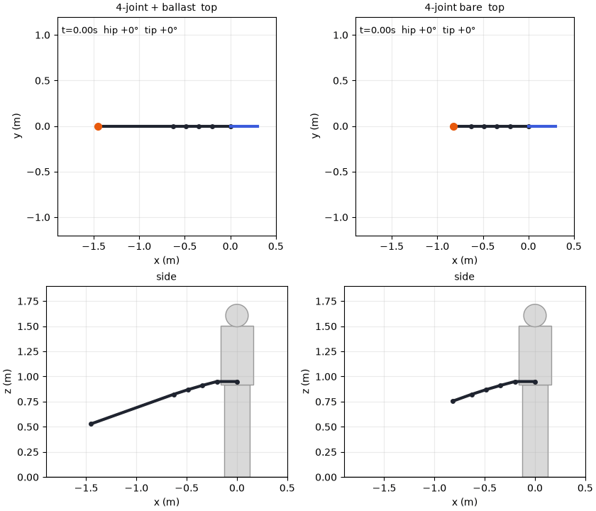

## Reproduce

```bash
python3 -m venv ~/.venvs/costumebipedaltail && ~/.venvs/costumebipedaltail/bin/pip install -r requirements.txt
PYTHONPATH=. ~/.venvs/costumebipedaltail/bin/python -m unittest -v tests.test_physics tests.test_cad
PYTHONPATH=. ~/.venvs/costumebipedaltail/bin/python experiments/run_suite.py      # studies, plots, animations, CSV
PYTHONPATH=. ~/.venvs/costumebipedaltail/bin/python experiments/make_tables.py    # docs/tables
~/.venvs/costumebipedaltail/bin/python cad/export_stl.py                          # STLs (OpenSCAD)
python3 cad/render_views.py                                                       # CAD renders
~/Applications/freecad-experiment/squashfs-root/usr/bin/freecadcmd cad/freecad/build_tail.py   # FCStd + STEP
```
