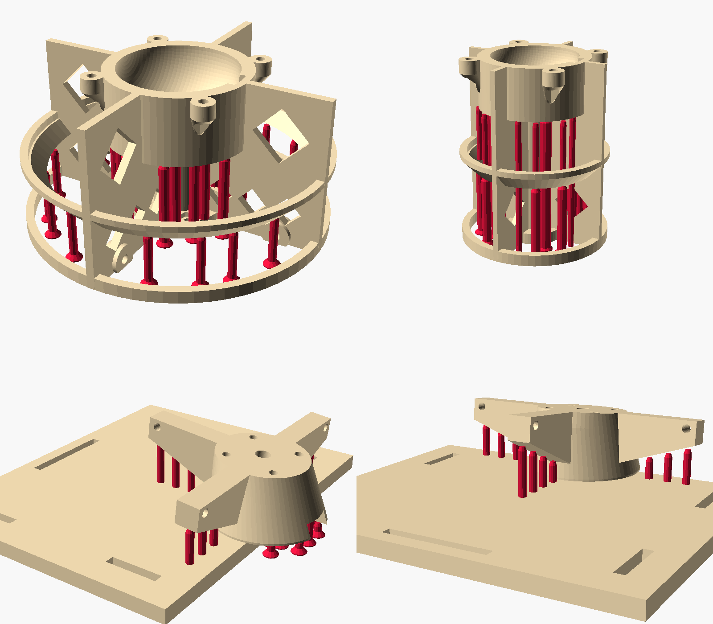

# Life-size Barney tail STLs with built-in support columns

**Print these with slicer supports off.** They're the same parts as `../barney/`, in the same orientation, with
break-away columns added. The 7 parts not in this folder need no support; print them from `../barney/`:
ball_5 left and right, ball_6_right, and cap_1, cap_4, cap_5, cap_6.

- **Column shape:**
  - Ø4 mm, or Ø5 above 30 mm tall and Ø6 above 45 mm tall.
  - Each tapers to a Ø2.6 mm tip.
  - Columns on the bed stand on a Ø8 mm, one-layer foot.
- **Gaps:** one 0.6 mm layer of air under the part (and under columns that stand on the part), and at least
  0.45 mm clearance everywhere else.
- **Removal:** snap or twist columns off, then scrape the contact dots flush.
- **Bearing surfaces:** no column touches the socket bowls, cap cones or ball bearing surfaces. Those face up or
  are self-supporting.
- **Regenerate:** `PYTHONPATH=. ~/.venvs/costumebipedaltail/bin/python cad/add_support_columns.py`. Per-part
  counts are in `report.json`; the rules are in `docs/printing.md`.

| Part | Columns | Column PETG (ml) | Tallest (mm) |
|---|---|---|---|
| body_1 | 36 | 21.0 | 42.6 |
| body_2 | 35 | 26.3 | 49.7 |
| body_3 | 29 | 34.2 | 59.8 |
| body_4 | 21 | 12.9 | 50.3 |
| body_5 | 25 | 21.8 | 50.9 |
| body_6 | 28 | 20.0 | 72.6 |
| hip_mount | 23 | 3.5 | 24.6 |
| tip_adapter | 2 | 0.4 | 21.4 |
| ball halves (9 files) | 1–2 each | ≤ 0.2 each | ≤ 11 |
| cap_2, cap_3 | 1 each | < 0.1 | ≤ 9 |
| **Total** | **216** | **~142 (~180 g)** | |

In Cura, keep **Union Overlapping Volumes** on (the default). Don't use "Remove All Holes".
