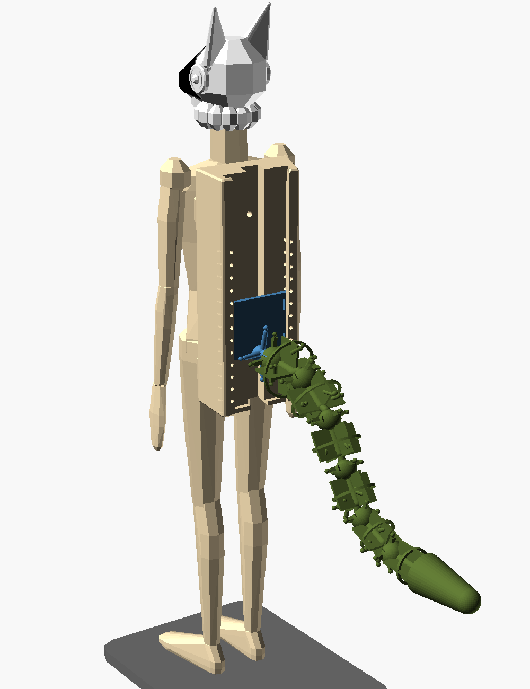
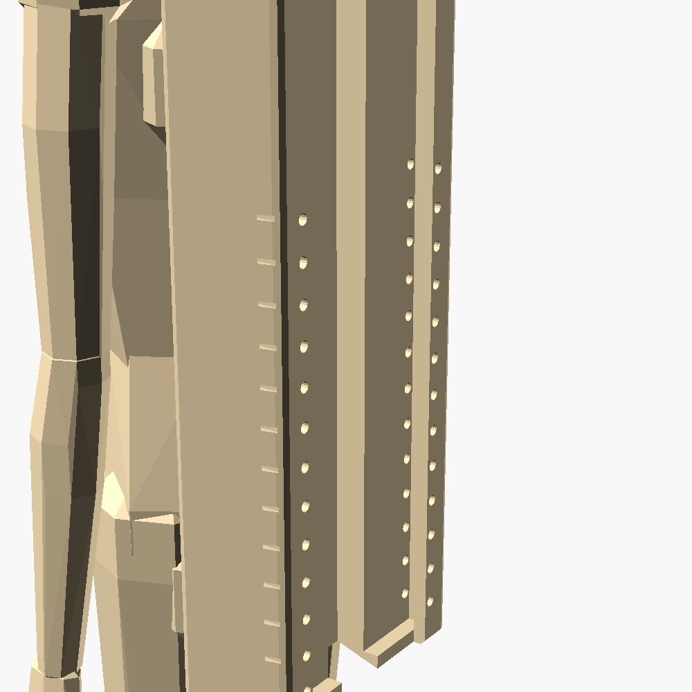
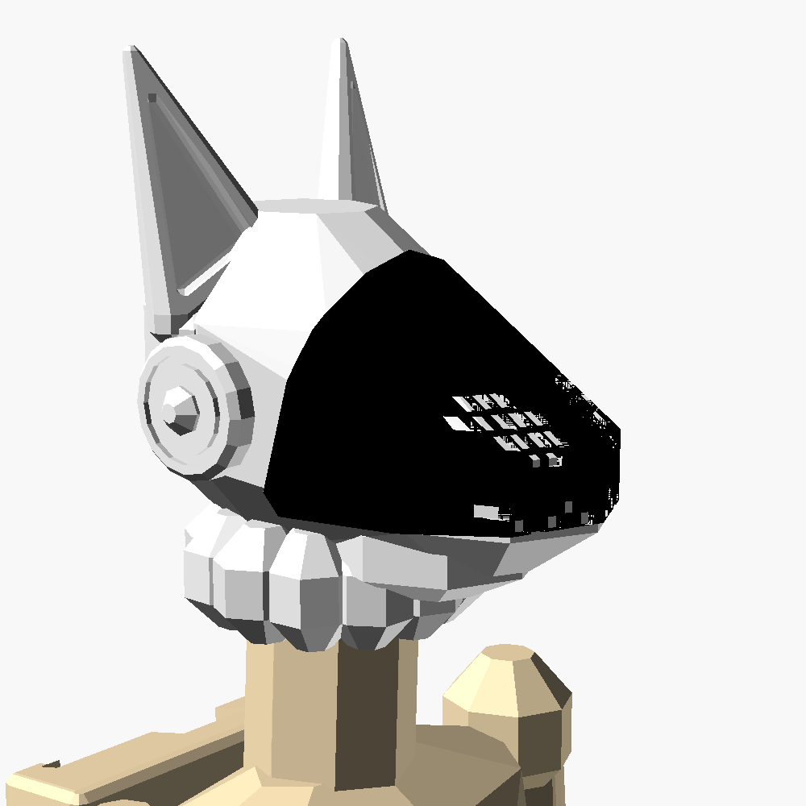

# 1:8 low-poly display figurine with a protogen head

A 1:8 stand-in for the performer, for trying the [1:8 resin tail kit](../replica_1to8_resin/README.md) at
different heights on the back. It's printed on the Anycubic Photon Mono 5s in ABS-Like Pro 2.
- **Body:** a skinny 5 ft 8 in (1727 mm) male at 1:8, so 216 mm to the crown of a human head. Key heights follow
  standard anthropometric fractions of stature (shoulder 0.82 H, hip joint 0.53 H, knee 0.285 H). The pelvis centre
  sits 0.55 H above the floor, which is the same frame the tail CAD uses.
- **Head:** a protogen head replaces the human one:
  - a black visor with recessed pixel eyes and a zigzag mouth;
  - tall ears with inner-ear recesses;
  - round side "ear" discs with an LED ring groove;
  - a fur ruff at the neck.

  It sits on a Ø3.9 mm neck peg, so it can turn.
- **Style:** deliberately low-poly (8-facet organic shapes), which keeps the files small and the export light.
  The mechanical fits (peg, socket, pin holes, the channel) keep full resolution.


## The back slot

A raised "cyber spine" rail on the back carries a T-channel that takes the kit's `01_hip_mount_plate` unchanged:
- **Edges:** the plate's edges run behind two lips, with 0.2 mm clearance.
- **Tab:** its stand tab runs in a centre groove.
- **Front face:** it sits exactly where the full-size design puts it (120 mm behind the pelvis centre at 1:1).
- **Insertion:** slide the plate in from the top of the rail.
- **Level pins:** push a level pin (`23_level_pin`, or a 1 mm paperclip wire) through a pair of lip holes, and
  the plate's bottom edge rests on the pins.

| Pin row | Plate raised from the design height (1:8 / full size) |
|---|---|
| none (plate on the channel floor) | −16 mm / −128 mm (lowest) |
| 13 rows, 4 mm apart | −12 … +36 mm / −96 … +288 mm |
| long tick mark | 0 = the approved design height |

The boss and joint-1 ball under the plate pass out through an opening in the bottom of the rail.
`export_figurine.py` slides the real plate STL through every level and checks it doesn't touch the body
(`plate_clearance` in `report.json`: all zero).

  

## Print list

| File | Size (mm) | Resin (ml) | Notes |
|---|---|---|---|
| `20_figure_body.stl` | 44.5 × 55.9 × 194.7 | 56.7 | torso hollowed (2 mm wall) |
| `21_protogen_head.stl` | 35.2 × 26.9 × 37.9 | 9.8 | |
| `22_display_base.stl` | 86 × 64 × 4 | 21.8 | fine on the Ender 3 V2 in PETG too |
| `23_level_pin.stl` | 2.2 × 2.2 × 7.2 | <0.01 | print 2 (plus spares) |

- **Body:**
  - At 195 mm, the body fits the 200 mm Z height upright. Keep any tilt in the slicer under about 10°, or lay
    it at about 45°, which fits the 218 mm X axis.
  - Put supports on the soles, the underside of the hands, and the chin of the neck. Keep them out of the
    channel.
  - The torso is hollow. Resin drains through a Ø2.4 mm hole in the crotch and vents into the top of the tab
    groove. Flush both holes well before curing.
- **Head:** print it upright on its ruff, lightly supported under the snout and ruff, with no supports in the
  peg socket.
- **Layers:** 0.05 mm. Wash and cure gently.

## Assembly

1. Push the head onto the neck peg.
2. Press the foot pegs into the base and glue them if you like.
3. Assemble the tail kit on its hip plate as its README describes, then slide the plate into the rail from the
   top.
4. Push a pin through both holes of the chosen row. Slide the plate down onto it.

The figure, head, base, plate and tail total about 103 g of resin. The combined centre of mass is 43 mm ahead of
the base's rear edge, so it won't tip at any level.

## Regenerate

```
PYTHONPATH=. ~/.venvs/costumebipedaltail/bin/python cad/export_figurine.py   # STLs + checks (~2 min, ~2.5 GB RAM)
PYTHONPATH=. ~/.venvs/costumebipedaltail/bin/python cad/render_figurine.py   # preview images
```
The source is `cad/openscad/figurine_1to8.scad`. Use `LP` for facet count, `LEVELS`/`DZ_MIN` for the pin rows,
and `c_x`, `c_y` for the channel clearances.
