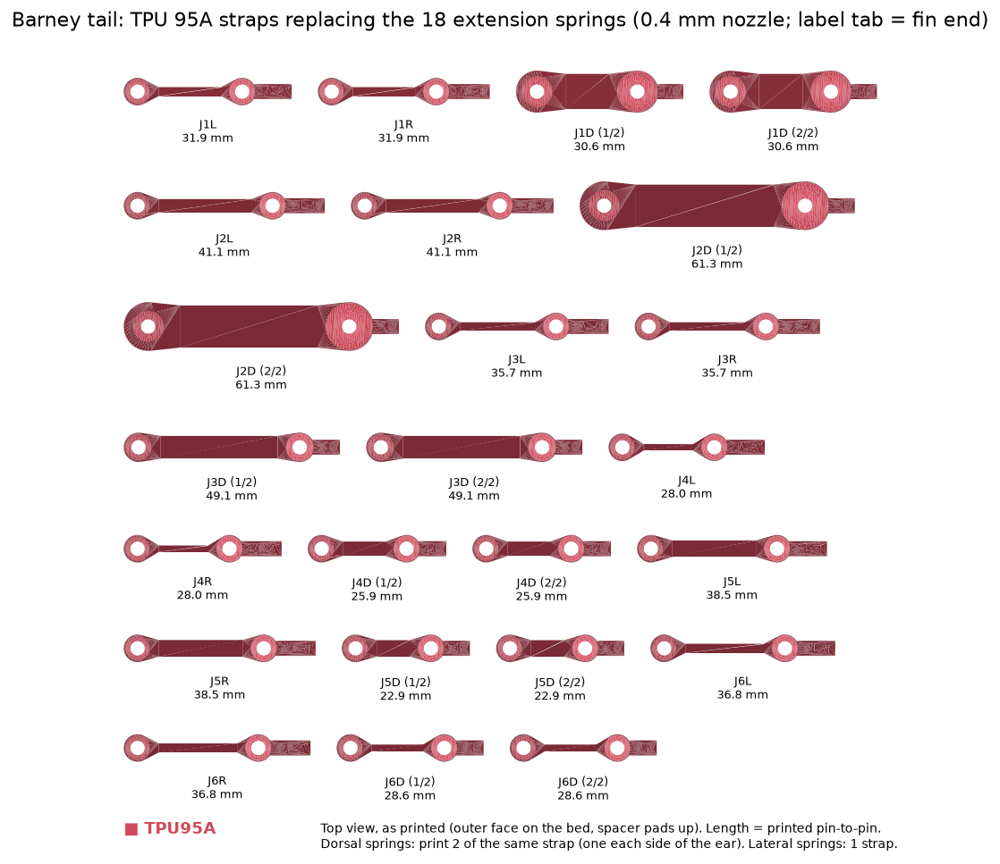
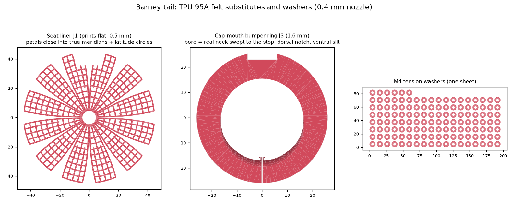

# Printed TPU 95A parts for the Barney tail: spring straps, felt substitutes, washers

The extension springs were delayed, there's no felt, and the flexible filament on hand is **TPU 95A** (plus
64D, which is far too hard to act as a spring). Everything here prints in **95A with a 0.4 mm nozzle**. Nothing
already built needs reprinting.

| What | Print file(s) | Replaces |
|---|---|---|
| 24 straps (18 spring positions), labelled | `cad/stl/barney_tpu_bands/plate_all_straps.stl`: **one plate, print once** | the 18 extension springs |
| 12 spare straps, +10 % preload | `cad/stl/barney_tpu_bands/plate_tight10_spares.stl` (optional) | rest-pose trimming |
| 6 seat liner webs | `cad/stl/barney_tpu_liners/plate_seat_liners_part1of2_print1x.stl` + `..._part2of2_print1x.stl` | 0.5 mm felt in each socket seat |
| 6 cap-mouth bumper rings | `cad/stl/barney_tpu_liners/plate_mouth_rings_print1x.stl` | 0.8 mm felt stop pads |
| 132 M4 tension washers | `cad/stl/barney_tpu_liners/plate_washers_M4_132x_print1x.stl` | backup for the nylon washers |

- Single parts are in the sub-folders.
- Generators: `cad/tpu_bands.py` (straps) and `cad/tpu_liners.py` (liners, rings, washers).
- Checks: `cad/check_tpu_bands.py`, `cad/check_tpu_liners.py`, and `tests/test_tpu_*.py`.
- Simulation: `experiments/tpu_band_sim.py` → [tables/tpu_band_sim.md](tables/tpu_band_sim.md).
- Strap schedule: [tables/tpu_bands.md](tables/tpu_bands.md).




## Why a 0.4 mm nozzle

A strap has no built-in preload like a spring, so it must sit pre-stretched by T0/k at the rest span. That ratio
comes from the spring schedule, not the material. For 95A the stiffness then depends on how *small* a section
can be printed:

| Nozzle | Smallest strap section | Positions where 95A matches the spring rate |
|---|---|---|
| 1.2 mm | 3.0 × 1.2 mm | 2 of 18 (the rest 1.2–4× too stiff) |
| 0.6 mm | 2.4 × 0.9 mm | 6 of 18 |
| **0.4 mm** | **1.8 × 0.6 mm** | **15 of 18** |

The three exceptions are the high-preload dorsal positions:
- J1 dorsal is 2.0× stiffer, J4 dorsal 2.5× and J5 dorsal 1.65×.
- Matching them would need more than 25 % rest strain, which is past 95A's knee, where it creeps and sets.
- Their preload (T0) is still exact, so the rest pose is right; those joints are simply stiffer in pitch.

## Straps

- **Dorsal springs:** a pair of identical straps, one on each face of the cap ear and the fin (or hip-mount arm).
- **Lateral springs:** one strap, on the face the pull leans toward.
  - The rest-curve wedges tilt the parent fin by up to 30°, so a far-side strap would have to pass through the
    ear.
- **Mounting:** M4 bolts through the existing 4.5 mm spring holes.
- **Spacer pads:** printed on the eyes. They clear the flared ear and the ear's corner at full yaw.
- **Label tab:** at the **fin / hip-arm end**, debossed:
  - `3D`: joint 3 dorsal (pair).
  - `3L-T` / `3R-B`: joint 3 left or right lateral, on the **top** (dorsal) or **bottom** (ventral) face of the
    ear and fin.
  - A trailing `+` marks a tight spare.
- **Fit check:**
  - Strap, spacers, label tab, washers, bolt heads and nylocks were checked against the printed part meshes at
    rest and at ±yaw and ±pitch limits.
  - The worst case is a 0.4 mm³ graze at a full-bend stop.
- **Bolts:** M4 socket head with a washer each side plus a nylock: 12 × M4×25, 17 × M4×30, 6 × M4×35, 1 × M4×40.
  The fit check assumed 0.8 mm washers, which matches the TPU washer sheet.

| Check | Result |
|---|---|
| Preload T0 | equals the spring on all 18 positions |
| Rate k | equal on 15 positions; J1 dorsal 2.0×, J4 dorsal 2.5×, J5 dorsal 1.65× |
| Force at the angular stop | below the springs except J1 dorsal (158 vs 146 N) and J4 dorsal (55 vs 50 N) |
| Peak tension over every simulated motion (jump included) | J1 dorsal 180 N (springs 148 N). Cap-ear bending safety factor 9.2 (springs 11.2) |
| Strap stress | 7–10 MPa at the stops, about 10 MPa at the J1 peak: well under 95A's ~30 MPa strength, but near its knee, so expect a little set after hard stops (use the `+` spares) |

## Felt substitutes: is TPU good in the joints? Yes, with one caveat

The simulation decided it: [tables/tpu_band_sim.md](tables/tpu_band_sim.md), all cases with the 95A straps.

| Seat surface | Snap overshoot | Settle | 45° turn overshoot | Peak belt moment |
|---|---|---|---|---|
| Felt liner (design, μ 0.25) | 9° | 1.25 s | 32° | 21.6 N·m |
| **TPU liner web (μ ≈ 0.45)** | **11°** | **0.76 s** | **25°** | **13.2 N·m** |
| Bare PETG (μ 0.12) | 24° | 3.61 s | 53° | 41 N·m |

- **Bare PETG** isn't just noisy: the tail swings much more and loads the belt three times as hard.
- **The TPU liner's** extra friction calms the stiffer straps. It is the best of the three.

### Seat liner web (one per joint, prints flat)

- **Shape:** a hub ring round the cord bore, plus 12 petals.
- **The mapping:** a point on the seat sphere (angle θ from the pole, longitude φ, petal centre φₖ) is printed
  at flat radius R·θ and angle φₖ + (φ − φₖ)·sin θ/θ.
  - So every latitude strand prints at its **true** length R·sin θ·Δφ, and every petal-centre meridian at its
    true length R·Δθ.
  - Pressed into the seat, the petal edges close up. The latitude strands join into whole circles and the
    meridians run pole to rim.
  - The largest leftover stretch anywhere in the web is **1.1 %**, which TPU takes up without noticing.
- **Strands:** 0.9 mm (two lines), on a 3.5 mm grid, 0.5 mm thick (two 0.25 mm layers). That is the felt
  thickness the seat was sized for, leaving 0.4 mm running clearance.
- **Roll-key slot:** the dorsal seam stays open over it.
- **Fitting:** drop the web into the vertebra body's seat, hub over the cord bore and petals up the wall, before
  setting the body onto its ball. The ball holds it in place.

### Cap-mouth bumper ring (one per joint)

This is the part that stops the clank: it's where the neck hits the cap at the end of each swing.
- **What it is:** a flat 1.6 mm split ring. Glue it to the cap's outer face around the mouth with CA or contact
  cement.
- **Bore:** cut from the real neck geometry, the union of the ball's sections through the ring, swept over every
  bend direction up to that direction's stop.
  - Within the stop, the ring touches nothing.
  - At the stop, the neck lands on TPU.
- **Mesh check** (`cad/check_tpu_liners.py`, 8 directions per joint):
  - 0.3° inside the stop: no contact with the neck or the parent flange's bolt heads.
  - 1° past it: the neck is into the TPU, and the PETG rim is still clear.
- **Fitting:**
  - Open the ventral slit, slip the ring round the neck and glue it down.
  - The dorsal notch goes over the roll-key slot.

### Pre-existing finding: the stops on rest-bent joints don't match the design

The ball necks carry the rest-curve wedge, which turns the neck toward the parent axis just outside the cap.
Because of that, the real PETG neck-to-cap contact angle depends on direction:

| Joint | Design stop | PETG contact, measured on the meshes |
|---|---|---|
| J1 | 8° | 10.7° all round (as designed, with the 0.8 mm pad gap) |
| J2 | 11° | 11.3° pitch-down … 16.8° pitch-up |
| J3 | 14° | 13.5° pitch-down … 20.5° pitch-up |
| J4 | 18° | 19.6–21.7° |
| J5 | 22° | **16.4° pitch-up**; pitch-down: no contact until about **32–40°** (ball against cap) |
| J6 | 26° | **21.8° pitch-up**; pitch-down: no contact until about **40°** |

- **What the rings cover:** in every direction they put the stop back at the design angle, or 1.5° before any
  early PETG contact.
- **What they can't cover:** J5 and J6 pitching down, where the neck leans away from the cap face. Nothing on
  the cap face can reach it there; a taller ring that still prints without supports doesn't reach it either.
- **What holds those directions now:** only the dorsal straps or springs, until the ball hits the cap at
  32–40°.
- **Effect:** hard jump landings may still knock there. The fix is a CAD change (cap or wedge geometry) in a
  later revision.

## TPU M4 washers

- **Size:** 9 mm OD, 3.7 mm bore (snug on the M4 thread, so it stays put and acts as a light lock and spring
  washer), 0.8 mm thick.
- **Count:** 24 cap bolts and 24 ball-flange bolts (under the heads) plus 72 at the strap bolts (one each side)
  is 120. With 10 % spares that's 132, all on one sheet, printed once.
- **Under cap and flange heads:** the extra 0.8 mm still leaves the M4×16 bolts fully through their nylocks.

## Printing (Ender 3 V2, Sprite Pro, 0.4 mm nozzle, TPU 95A)

| Setting | Value |
|---|---|
| Layer | 0.2 mm for straps, rings and washers; 0.25 mm for the liner webs (two layers) |
| Speed | 20–25 mm/s (first layer 10–15) |
| Temperature | 225–235 °C nozzle, 50 °C bed; glue stick on PEI as a release layer |
| Retraction | ≤ 1 mm, slow; or off |
| Walls | enough to make each strap all perimeters (5–6 walls); infill 100 % |
| Supports | none (every part is flat or self-supporting) |

## Coupon calibration (optional, about 30 min, makes the forces trustworthy)

The straps use a nominal 95A curve; brands differ by up to 3×.
1. Print `calibration/coupon_tpu95a.stl`.
2. Stretch it 10 times to about 72 mm pin-to-pin.
3. Hang it from a bolt, and measure the pin-to-pin length (outside of the bolts minus 4 mm) with an empty bag,
   then with 1, 2 and 3 kg. Read each after 30 s.
4. Write `cad/tpu_calibration.json`:
   ```json
   {"tpu95a": {"width": 4.0, "thickness": 1.2, "points": [[0, 63.5], [1, 66.9], [2, 71.0], [3, 76.2]]}}
   ```
   (Example numbers; use your measured width and thickness.)
5. Run `PYTHONPATH=. python cad/tpu_bands.py --calib cad/tpu_calibration.json`. This rewrites all straps and
   plates and re-runs the fit check.

## Installing

1. **Break in each strap:** 10 stretches to its "break-in" length in the schedule.
2. **Seat liners:** fit one into each body's seat before that body goes onto its ball.
3. **Bumper rings:** glue one onto each cap face once the cap halves are bolted.
4. **Strap bolt stack:**
   - Dorsal pair: head, washer, strap (pad toward the ear), ear, strap, washer, nylock.
   - Lateral strap: head, washer, ear, strap on the labelled face, washer, nylock.
   - The label tab end goes on the **fin / hip arm**.
5. **Fitting the heavy dorsal straps:** cap end first, with the joint pitched up against its stop. Pull the eye
   over with a screwdriver shaft through it.
6. **Leave the eyes free to swivel:** snug each nylock, then back it off ¼ turn.
7. **Trim the rest pose:** the tail end should sit level, sticking straight back, with skin about 52 cm off the
   floor. Swap a sagging joint's dorsal pair for its `+` spare.
8. **When the springs arrive:** unbolt the straps and hook the springs into the same holes, using
   [tables/barney_springs.md](tables/barney_springs.md). Keep the liners, rings and washers.

## Caveats

- **Creep:** 95A loses some preload over hours, more after hard stops. Check the tail end's height between
  wearings and carry the `+` spares and a hex key.
- **Heat:** don't leave the tail tensioned in a hot car (TPU softens above about 40 °C).
- **J5/J6 pitch-down stop:** see the pre-existing finding above.
